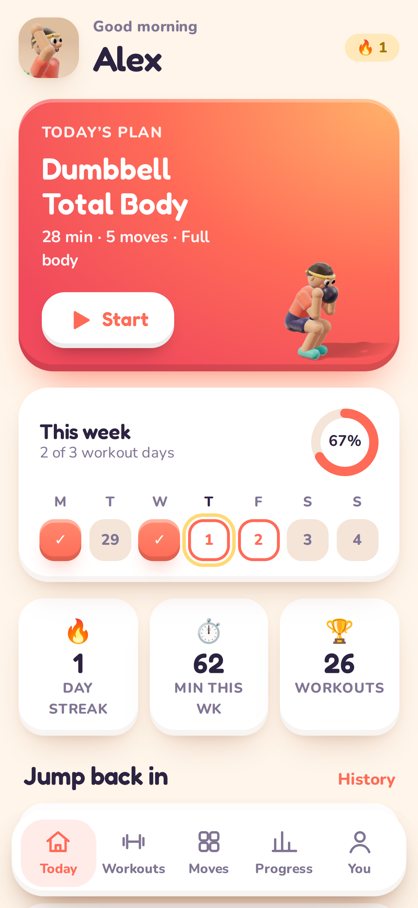
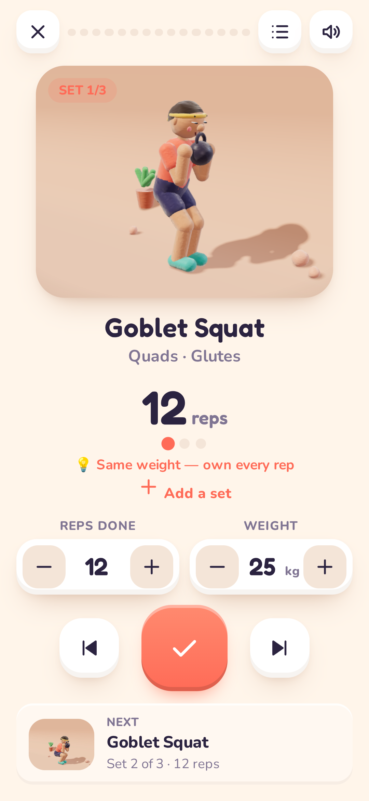
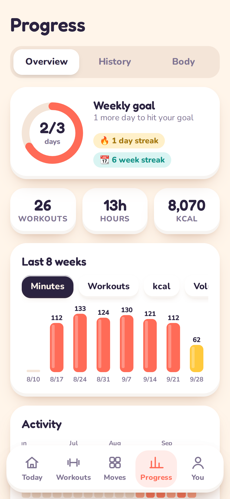

# Huff n Puff 💦 — the workout crew that moves with you

Huff n Puff is a playful, private workout tracker for Android, installable as a Progressive Web App (PWA). Instead of stock exercise videos, every move is performed by a **3D claymation character** rendered live with WebGL. The character is built from lumpy, hand-pressed plasticine shapes with fingerprint-textured materials. It stands on a little stop-motion set with soft studio lighting and shadows, and animates at 12 fps with a "boil" effect, slight exposure flicker and a gently drifting camera. A 2D SVG version is the fallback on devices without WebGL.

<p align="center">  </p>

**No accounts. No cloud. No tracking.** Everything stays on your device (IndexedDB), and the app works fully offline.

## Features

- **65 exercises**, each with its own clay animation, step-by-step instructions, coach tips, common mistakes and a muscle map.
- **20 ready-made workouts**: the Classic 7-minute circuit, HIIT, core, mobility, dumbbell, kettlebell, barbell push/pull/legs, jump rope, desk breaks, bedtime stretches and more.
- **Guided player**
  - Timed circuits with get-ready, work and rest phases, rounds, and round breaks.
  - Strength mode with sets × reps, weight logging, auto rest timers (+15s / skip) and timed holds.
  - Voice coach, beeps, vibration and screen wake lock.
  - Android back-button safe; a workout interrupted mid-way can be resumed.
- **Smart progression**: suggests the next weight or reps from your last session, estimates your 1RM and detects personal records automatically.
- **Workout builder**: build circuits or strength routines, reorder moves, tweak sets, reps, rest and work time. You can also customise a copy of any built-in workout.
- **Weekly plan**: generated from your goal, level, equipment and training days. Swap any day.
- **Progress**: weekly goal ring, day and week streaks, 8-week charts (minutes, workouts, kcal, volume), a GitHub-style activity calendar, a 7-day muscle heat map, personal records, a body-weight trend with BMI, and 20 badges.
- **A clay cast of 7**: each move is performed by a character picked for it, in their own set:
  - Bruno, a moustached bean, lifts on a workbench
  - Jolene does 80s VHS aerobics
  - DJ Dee runs HIIT on a light-up disco floor
  - Fern does forest yoga with a fox
  - Merlin works his core in a wizard's tower
  - Chef Bao trains in the kitchen with a cat
  - Pip covers everything else

  The characters are soft, deformable clay: sculpted one-piece bodies, noodle limbs, squash and stretch, faces that strain on effort, and held-then-snappy stop-motion timing. Switch characters on or off under You → Meet the cast.
- **Graffiti brand**: a spray-paint logo, “huff” stacked over “puff” with a little “n” squashed between them, on the brand yellow. The logo is drawn on a canvas by `tools/hnp-logo.js`; `node tools/render-icons.mjs` (with the dev server running) renders it to `icons/logo.webp` and every app icon. The whole cast floats around the welcome screen.
- **Full-screen player**: the scene fills the screen behind floating controls, with a big 3-2-1 before you start. Swipe left or right to change moves.
- **Rest-period films**: when the next move belongs to someone else, they walk into the current set and the pair do their own bit (21 handovers: tosses, high fives, bows, a wizard's zap, a dance-off…), then the camera cuts to the next set with that pair's own move and wipe. Same character next? They take a breather (three per character, cycled), and on longer rests they get ready for the type of move coming up. Rest between moves is 10 s by default (You → Training).
- **Play as anyone**: pick a cast member in onboarding or under You. They take your name, your story and your colours.
- **Move feedback**: thumbs up/down on any move (thumbs-down hides it), and skips are logged. Moves → Feedback shows the most-skipped moves and copies a report. Paste it when asking for a move-library refresh: skipped and disliked moves get archived (`ARCHIVED` in `js/exercises.js`) and the liked ones steer which new moves get made.
- Light, dark and auto themes; kg or lb.
- **Your data, portable**: JSON backup and restore, plus CSV export of every set.

## Voice coach

Spoken cues are pre-recorded at deploy time with Microsoft Edge's neural voices via the `edge-tts` Python package. Several voices are recorded (Andrew is the default) and you pick one under You → Preferences → Voice.

- **When:** the Pages workflow runs `tools/voice-lines.mjs` (every line the coach can say, from `js/voice-lines.js`) and `tools/build-audio.py`, which writes `audio/voice/*.mp3` plus `manifest.json`. The app strings clips together (for example "Rest. Next up:" + "Wall Sit.").
- **Caching:** clips are named by a hash of voice, rate and text, and kept between deploys with `actions/cache`, so only new or changed lines are recorded. On phones they're cached by the service worker. Each workout pre-loads its own lines when it starts.
- **Fallback:** if a line has no recording or the manifest can't load, the device's own voice speaks instead. You → Preferences lets you choose Natural or Device voice, pick the device voice, and set the speed.
- **Rests:** the coach says "Rest.", then announces the next move a few seconds before the end, early enough that the whole name is spoken before the final 3-second countdown (clip lengths are stored in each voice's manifest).
- **Changing the voices:** set the repository variable `TTS_VOICES` (a comma list of Edge neural voices, first = default) and `TTS_RATE` (such as `-5%`).
- Edge's voices are an unofficial route to a free Microsoft service. If recording fails, the deploy still ships, logs a summary, and the app uses the device voice.

## Install on Android

1. Open the GitHub Pages URL in Chrome.
2. Tap **Install** on the Today screen, or use the ⋮ menu → **Install app**.
3. Huff n Puff launches full-screen from your home screen and works offline.

## Hosting on GitHub Pages

`.github/workflows/pages.yml` builds the site on every push to the default branch and publishes it to the `gh-pages` branch. Pages is configured to serve it under **Settings → Pages → Deploy from a branch → `gh-pages` / `(root)`**.

The app is published at **https://huffnpuff.club/**.

**Custom domain.** The `CNAME` file in the repository root names the domain, and every deploy copies it into the site, so the domain survives the workflow's fresh `gh-pages` pushes. The repository variable `PAGES_DOMAIN` overrides it. Delete the file to go back to the github.io address. Each deploy stamps a fresh service-worker cache version, so installed apps update themselves and show a "Reload" prompt.

## Development

Huff n Puff is plain HTML, CSS and ES modules, with **no build step**. The only dependency is a vendored three.js subset.

```bash
npx http-server -c-1 .     # or: python3 -m http.server
open http://localhost:8080
```

| Path | What it is |
| --- | --- |
| `js/clay.js` | Animation rig: forward kinematics, auto ground contact/leveling, keyframes, and the 2D SVG fallback renderer |
| `js/cast.js` | The clay cast: 7 characters, their sets, which moves each performs, quips |
| `js/clay3d.js` | 3D stage: per-set lighting, depth of field, colour grade (VHS/grain/vignette), safe-area framing, live player, cached stills |
| `js/c3d/*.js` | Clay kit (textures, materials, lumpy primitives), character builder, stop-motion sets with pets, exercise props |
| `js/c3d/acts.js`, `js/c3d/director.js` | Rest-period acts (walks, high fives, breathers, warm-ups), the 21 pair handovers, and the director that stages them |
| `js/feedback.js` | Skip log, thumbs up/down, and the move-library refresh report |
| `js/vendor/three.js` | Tree-shaken three.js subset, rebuilt with `tools/build-three.sh` |
| `js/exercises.js` | Exercise library and per-exercise keyframes |
| `js/workouts.js` | Built-in routines, time estimates, plan generator |
| `js/store.js` | Local storage (IndexedDB with a localStorage fallback), backup and restore |
| `js/stats.js` | Streaks, PRs, 1RM, muscle load, calories, badges |
| `js/views/*` | Screens (onboarding, today, workouts, library, player, summary, progress, session, profile, builder) |
| `sw.js` | Offline service worker |
| `tools/gallery.html`, `tools/gallery3d.html` | Contact sheets of every clay animation, 2D and 3D (`?all=1&cols=2&ex=squat,push-up`) |
| `tools/smoke.mjs` | Playwright end-to-end smoke test |
| `tools/render-icons.mjs` | Renders the PNG icons from `tools/icon.html` |
| `tools/check-poses.mjs`, `tools/audit.html` | Checks every animation for impossible joints (knees or elbows bending backwards, limbs sweeping the long way round) and bodies passing through the floor, walls, bars, benches or barbells, and draws keyframes as big skeletons (`?ex=chin-up,wall-push-up`) |
| `tools/interlude.html`, `tools/film.mjs` | Preview a rest-period film and render a filmstrip (`node tools/film.mjs bb-squat jumping-jack out.png`) |

### Adding an exercise

Poses use a small shorthand: torso lean `t`, arms `ra`/`la` and legs `rl`/`ll` as absolute joint angles (0 = down, 90 = forward, 180 = up). The engine handles the rest. `lv` levels two contact points onto the floor (for example, hands and toes in a plank), `ax` pins a point horizontally, and `anchor` can hang the figure from a bar.

```js
def({
  id: 'squat', name: 'Bodyweight Squat', cat: 'strength', primary: ['quads', 'glutes'],
  anim: { tempo: 2.4, frames: [
    P({ t: 4, ra: [70, 78] }),
    P({ t: 38, ra: [92, 92], rl: [86, -28], ll: [84, -30] }),
  ] },
});
```

## Privacy

Huff n Puff makes no network requests beyond loading its own files. Calorie numbers are MET-based estimates, not medical advice.
